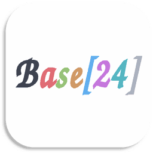

[](../../)
[](../../)
[](../../issues)
[](/LICENSE.md)
[](../../commits/master)
[](../../commits/master)

<!-- omit in toc -->
# Base24




- [Reason for this repo](#reason-for-this-repo)
- [Compatibility](#compatibility)
- [Why Base24/ Base16 is useful](#why-base24-base16-is-useful)
- [Documentation](#documentation)
- [Template Repositories](#template-repositories)
	- [Existing Base16 Templates](#existing-base16-templates)
- [Scheme Repositories](#scheme-repositories)
	- [Generated from existing themes](#generated-from-existing-themes)
	- [Existing Base16 Schemes](#existing-base16-schemes)
- [Builder Repositories](#builder-repositories)
	- [Base24 0.1.0 (Feb 2020)](#base24-010-feb-2020)
		- [Changes](#changes)
		- [Builders](#builders)
	- [Base16 0.9.1 (Jun 15, 2019)](#base16-091-jun-15-2019)
		- [Changes](#changes-1)
		- [Builders](#builders-1)
- [Download](#download)
	- [Clone](#clone)
		- [Using The Command Line](#using-the-command-line)
		- [Using GitHub Desktop](#using-github-desktop)
	- [Download Zip File](#download-zip-file)
- [Community Files](#community-files)
	- [Licence](#licence)
	- [Changelog](#changelog)
	- [Code of Conduct](#code-of-conduct)
	- [Contributing](#contributing)
	- [Security](#security)

## Reason for this repo

Base16 doesn't provide bright colours that are used in terminal emulators. e.g.
bright red. Base24 does. In addition to this, Base24 provides darker background
variants. This will also be part of a GitHub organization.

## Compatibility
The aim of this project is to offer compatibility with base16. The only
limitation is that a base24 builder is needed for base24 templates.

|Theme|⇒|Template|Base16 Builder|Base24 Builder|
|---|---|---|---|---|
|Base16|⇒|Base16|:heavy_check_mark:|:heavy_check_mark:|
|Base24|⇒|Base16|:heavy_check_mark:|:heavy_check_mark:|
|Base16|⇒|Base24|:x:|:heavy_check_mark:|
|Base24|⇒|Base24|:x:|:heavy_check_mark:|


Thank you to https://github.com/chriskempson/base16/ (MIT) for Base16


## Why Base24/ Base16 is useful

Base24/ Base16 can be used to easily generate your favourite theme for your
favourite application. Many of the template repositories provide theme files
that you can copy/ import into said application.


## Documentation

- [Styling Guidelines](styling.md)
- [Builder Guidelines](builder.md)
- [File Guidelines](file.md)
- [Roadmap/ TODO](roadmap.md)

## Template Repositories

To add your own template, submit a pull request to URL and add your repository to the list below. **Repository naming scheme: base24-\[template-name\]** (with dashes as separators).

- [CSS etc](https://github.com/Base24/base24-css-etc)
- [Gnome Terminal](https://github.com/Base24/base24-gnome-terminal)
- [HTML](https://github.com/Base24/base24-html)
- [iTerm2](https://github.com/Base24/base24-iterm2)
- [Kate](https://github.com/Base24/base24-kate)
- [KDEPlasma](https://github.com/Base24/base24-kdeplasma)
- [Kitty](https://github.com/Base24/base24-kitty-te)
- [Konsole](https://github.com/Base24/base24-konsole)
- [Slack](https://github.com/Base24/base24-slack)
- [Termux](https://github.com/Base24/base24-termux)
- [VSCode](https://github.com/Base24/base24-vscode)
- [VSCode Terminal](https://github.com/Base24/base24-vscode-terminal)
- [Windows Terminal](https://github.com/Base24/base24-windows-terminal)
- [XFCE4 Terminal](https://github.com/Base24/base24-xfce4-terminal)


### Existing Base16 Templates
- [Alacritty](https://github.com/aaron-williamson/base16-alacritty)
- [Binary Ninja](https://github.com/evanrichter/base16-binary-ninja)
- [Blink](https://github.com/niklaas/base16-blink)
- [C Header](https://github.com/m1sports20/base16-c_header)
- [ConCfg](https://github.com/h404bi/base16-concfg)
- [ConEmu](https://github.com/martinlindhe/base16-conemu)
- [Console2](https://github.com/AFulgens/base16-console2)
- [ConsoleZ](https://github.com/AFulgens/base16-consolez)
- [Crosh](https://github.com/philj56/base16-crosh)
- [Dunst](https://github.com/khamer/base16-dunst)
- [Emacs](https://github.com/belak/base16-emacs)
- [fzf](https://github.com/nicodebo/base16-fzf)
- [Godot](https://github.com/Calinou/base16-godot)
- [GTK+2](https://github.com/dawikur/base16-gtk2)
- [Highlight](https://github.com/bezhermoso/base16-highlight)
- [i3](https://github.com/khamer/base16-i3)
- [i3status](https://github.com/Eluminae/base16-i3status)
- [i3status-rust](https://github.com/mystfox/base16-i3status-rust)
- [Jetbrains](https://github.com/adilosa/base16-jetbrains)
- [JOE](https://github.com/jjjordan/base16-joe)
- [Kakoune](https://github.com/leira/base16-kakoune)
- [mako](https://github.com/Eluminae/base16-mako)
- [MinTTY](https://github.com/geoffstokes/base16-mintty)
- [MonoDevelop](https://github.com/netpyoung/base16-monodevelop)
- [Prism](https://github.com/atelierbram/base16-prism)
- [prompt-toolkit & ipython](https://github.com/memeplex/base16-prompt-toolkit)
- [PuTTY](https://github.com/benjojo/base-16-putty)
- [Pygments](https://github.com/mohd-akram/base16-pygments)
- [QOwnNotes](https://github.com/themix-project/base16-template-qOwnNotes)
- [Qt Creator](https://github.com/ilpianista/base16-qtcreator)
- [qutebrowser](https://github.com/theova/base16-qutebrowser)
- [Rofi](https://gitlab.com/0xdec/base16-rofi)
- [Scide](https://github.com/brunoro/base16-scide)
- [Shell](https://github.com/chriskempson/base16-shell)
- [st](https://github.com/honza/base16-st)
- [StumpWM](https://github.com/tpine/base16-stumpwm)
- [Sway](https://github.com/rkubosz/base16-sway)
- [Termite](https://github.com/khamer/base16-termite)
- [TextMate & Sublime Text](https://github.com/chriskempson/base16-textmate)
- [Tilix](https://github.com/karlding/base16-tilix)
- [Vim](https://github.com/chriskempson/base16-vim)
- [Vis](https://github.com/pshevtsov/base16-vis)
- [Waybar](https://github.com/mnussbaum/base16-waybar)
- [Windows Command Prompt](https://github.com/iamthad/base16-windows-command-prompt)
- [Xcode](https://github.com/kreeger/base16-xcode)
- [Xresources](https://github.com/binaryplease/base16-xresources)
- [Xshell](https://github.com/h404bi/base16-xshell)
- [zathura](https://github.com/nicodebo/base16-zathura)

## Scheme Repositories

To add your own scheme, submit a pull request to URL and add your repository to the list below. **Repository naming scheme: base24-\[scheme-name\]-scheme** (with dashes as separators).

- [Brogrammer](https://github.com/Base24/base24-brogrammer-scheme)
- [Dracula24](https://github.com/Base24/base24-dracula-scheme)
- [Espresso](https://github.com/Base24/base24-espresso-scheme)
- [Framer](https://github.com/Base24/base24-framer-scheme)
- [Github](https://github.com/Base24/base24-github-scheme)
- [One Black](https://github.com/Base24/base24-one-black-scheme)
- [One Dark](https://github.com/Base24/base24-one-dark-scheme)
- [One Light](https://github.com/Base24/base24-one-light-scheme)

### Generated from existing themes
- [Generated from Iterm2 themes](https://github.com/Base24/base24-mbadolato-iterm2-color-schemes)

### Existing Base16 Schemes
- [Atelier](https://github.com/atelierbram/base16-atelier-schemes)
- [Atlas](https://github.com/ajlende/base16-atlas-scheme)
- [Black Metal](https://github.com/metalelf0/base16-black-metal-scheme)
- [Brush Trees](https://github.com/whiteabelincoln/base16-brushtrees-scheme)
- [Circus](https://github.com/stepchowfun/base16-circus-scheme)
- [Classic](https://github.com/detly/base16-classic-scheme)
- [Codeschool](https://github.com/blockloop/base16-codeschool-scheme)
- [Cupertino](https://github.com/Defman21/base16-cupertino)
- [Default](https://github.com/chriskempson/base16-default-scheme)
- [Fruit Soda](https://github.com/jozip/base16-fruit-soda-scheme)
- [Gruvbox](https://github.com/dawikur/base16-gruvbox-scheme)
- [Hardcore](https://github.com/callerc1/base16-hardcore-scheme)
- [Helios](https://github.com/reyemxela/base16-helios-scheme)
- [Heetch](https://github.com/tealeg/base16-heetch-scheme)
- [Horizon](https://github.com/michael-ball/base16-horizon-scheme)
- [iA](https://github.com/aramisgithub/base16-ia-scheme)
- [Icy](https://github.com/icyphox/base16-icy-scheme)
- [Materia](https://github.com/Defman21/base16-materia)
- [Material Theme](https://github.com/ntpeters/base16-materialtheme-scheme)
- [Material Vivid](https://github.com/joshyrobot/base16-material-vivid-scheme)
- [Mellow](https://github.com/gidsi/base16-mellow-scheme)
- [Mexico-Light](https://github.com/drzel/base16-mexico-light-scheme)
- [Nord](https://github.com/8-uh/base16-nord-scheme)
- [Nova](https://github.com/gessig/base16-nova-scheme)
- [Outrun](https://github.com/hugodelahousse/base16-outrun-schemes)
- [PaperColor](https://github.com/jonleopard/base16-papercolor-scheme)
- [Porple](https://github.com/AuditeMarlow/base16-porple-scheme)
- [Purpledream](https://github.com/archmalet/base16-purpledream-scheme)
- [Rebecca](https://github.com/vic/base16-rebecca)
- [Sandcastle](https://github.com/gessig/base16-sandcastle-scheme)
- [Snazzy](https://github.com/h404bi/base16-snazzy-scheme)
- [Solarflare](https://github.com/mnussbaum/base16-solarflare-scheme)
- [Solarized](https://github.com/aramisgithub/base16-solarized-scheme)
- [Summercamp](https://github.com/zoefiri/base16-summercamp)
- [Summerfruit](https://github.com/cscorley/base16-summerfruit-scheme)
- [Synth Midnight](https://github.com/michael-ball/base16-synth-midnight-scheme)
- [Tomorrow](https://github.com/chriskempson/base16-tomorrow-scheme)
- [Twilight](https://github.com/hartbit/base16-twilight-scheme)
- [Unikitty](https://github.com/joshwlewis/base16-unikitty)
- [Woodland](https://github.com/jcornwall/base16-woodland-scheme)
- [Zenburn](https://github.com/elnawe/base16-zenburn-scheme)
- [XCode Dust](https://github.com/gonsie/base16-xcode-dusk-scheme)
- [Old Unclaimed Schemes](https://github.com/chriskempson/base16-unclaimed-schemes) - If your scheme is in this repository, please give it a new home!

## Builder Repositories

**Repository naming scheme: base24-builder-\[language\]** (with dashes as separators). The separate headings are the latest versions of the spec supported by each builder.

### Base24 0.1.0 (Feb 2020)

#### Changes

base00 through base0F are identical to base16. See the table below for the
Base24 fall-backs:

|Base24|Base16|
|------|------|
|base10|base00|
|base11|base00|
|base12|base08|
|base13|base0A|
|base14|base0B|
|base15|base0C|
|base16|base0D|
|base17|base0E|

#### Builders

- [Base24 Builder Python](https://github.com/Base24/base24-builder-python)

### Base16 0.9.1 (Jun 15, 2019)

#### Changes

- Make baseXX-hex-bgr variables available to templates
- Warn when a template file has been overwritten

#### Builders

- [Base16 Builder Go](https://github.com/belak/base16-builder-go)
- [Base16 Builder PHP](https://github.com/chriskempson/base16-builder-php)
- [Base16 Builder Python](https://github.com/InspectorMustache/base16-builder-python)
- [Base16 Builder Rust](https://github.com/ilpianista/base16-builder-rust)


## Download
### Clone
#### Using The Command Line
1. Press the Clone or download button in the top right
2. Copy the URL (link)
3. Open the command line and change directory to where you wish to
clone to
4. Type 'git clone' followed by URL in step 2
```bash
$ git clone https://github.com/Base24/Base24
```

More information can be found at
<https://help.github.com/en/articles/cloning-a-repository>

#### Using GitHub Desktop
1. Press the Clone or download button in the top right
2. Click open in desktop
3. Choose the path for where you want and click Clone

More information can be found at
<https://help.github.com/en/desktop/contributing-to-projects/cloning-a-repository-from-github-to-github-desktop>

### Download Zip File

1. Download this GitHub repository
2. Extract the zip archive
3. Copy/ move to the desired location


## Community Files
### Licence
MIT License
(See the [LICENSE](/LICENSE.md) for more information.)

### Changelog
See the [Changelog](/CHANGELOG.md) for more information.

### Code of Conduct
In the interest of fostering an open and welcoming environment, we
as contributors and maintainers pledge to make participation in our
project and our community a harassment-free experience for everyone.
Please see the
[Code of Conduct](https://github.com/Base24/.github/blob/master/CODE_OF_CONDUCT.md) for more information.

### Contributing
Contributions are welcome, please see the [Contributing Guidelines](https://github.com/Base24/.github/blob/master/CONTRIBUTING.md) for more information.

### Security
Thank you for improving the security of the project, please see the [Security Policy](https://github.com/Base24/.github/blob/master/SECURITY.md) for more information.
